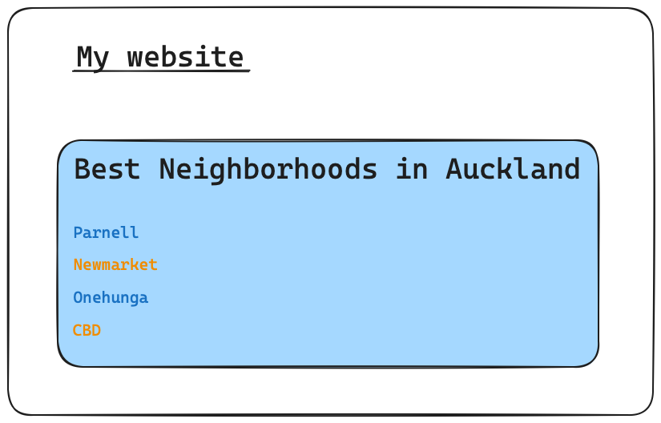

# CSS 102

## Exercises

### Other pseudo classes

Look up the following pseudo-classes and use them in a document:

:focus
:nth-child(n)
:last-child

### Practical applications

Color a list with alternating row colors. Given the following HTML

```
<ul>
  <li>One</li>
  <li>Two</li>
  <li>Three</li>
  <li>Four</li>
</ul>
```

Write a maximum of **two** CSS rules to color items `One` and `Three` in green and
items `Two` and `Four` in blue.

### Combining selectors, undoing selectors

Given the HTML in [this page](102.html):

```
<!DOCTYPE html>
<html lang="en">
<head>
    <meta charset="UTF-8">
    <meta name="viewport" content="width=device-width, initial-scale=1.0">
    <title>Combining Selectors Assessment</title>
    <link rel="stylesheet" href="styles.css">
</head>
<body>
    <header class="main-header">
        <h1>Website Title</h1>
        <nav>
            <ul>
                <li><a href="#">Home</a></li>
                <li><a href="#">About</a></li>
                <li><a href="#">Services</a></li>
                <li><a href="#">Contact</a></li>
            </ul>
        </nav>
    </header>
    <section class="content">
        <article>
            <h2>Article Title</h2>
            <p>This is a paragraph in an article.</p>
            <a href="#" class="read-more">Read more...</a>
        </article>
    </section>
    <footer>
        <p>&copy; 2024 Your Website</p>
    </footer>
</body>
</html>

```

Realize the following specs:

1. Set a font size of 16px for all paragraphs within the content section and add a bottom margin of 20px.
2. Style all links within the nav element to have a text color of #77aaff and have an underline. On hover, remove the underline.
3. Ensure the h1 element inside the header has a top margin of 20px and is centered.

## Project

- Build this website. 
- Comment your CSS. 
- Choose appropriate font sizes and only use `rem` as their unit.


